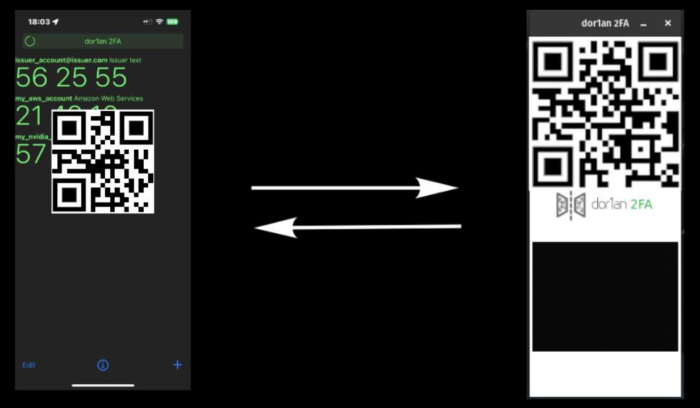

# dor1an 2FA
### Two-Factor Authentication application.

dor1an2FA is a free, open-source [two-factor authentication](https://en.wikipedia.org/wiki/Two-factor_authentication) app designed for simplicity. It uses innovative screen-to-camera communication to automagically autofill the 6-digit [TOTP](https://en.wikipedia.org/wiki/Time-based_one-time_password) token required as the second factor for secure web application logins.

It has two components: [dor1an2FA iOs mobile app](https://github.com/ch4r1i3b/dor1an2FA-ios) combined with a [dor1an2FA browser extension](https://github.com/ch4r1i3b/dor1an2FA-chrome-extension) in order to talk each other via screen-camera communication.


 


## Getting Started

1. Check out the latest version of the project:
  ```
  git clone https://github.com/ch4r1i3b/dor1an2FA-chrome-extension.git
  ```

2. In Google Chrome go to Extensons

3. Turn on "Developer mode".

4. Click "Load Unpacked" and browse the subdirectory where you clonned dor1an2FA-chrome-extension.


## Usage

### Install

1. Follow the steps in **Getting Started**.

2. Connect your iPhone to Xcode.

3. Select your iPhone device as target and run.

4. Download and install [dor1an2FA Chrome Extension](https://github.com/ch4r1i3b/dor1an2FA-chrome-extension).

### Setup

4. Add 2FA authentication of your 2FA requesting site to dor1an2FA (main screen, **+** button)

    a. Scan the QR code of the 2FA requesting site, or

    b. Add the parameters manually.

5. Edit the token you added (main screen, **Edit** button) and add the hostname of the 2FA requesing site.

### Authenticate

6. Navigate to the login page of the site where you need to authenticate using the second factor.

7. Enter you username and password as allways.

8. When you reach the page that is requesting for the second factor, the browser will pop up the extension window showing a QR (with the coded hostname) and starting the laptop camera.

9. Open dor1an2FA on your phone, and click on the token of that site.

10. Align the phone's front camera with the QR code displayed on the laptop screen.

11. dor1an2FA will check if the hostname matches, if not it will pop an error message.

12. If they are the same, dor1an2FA will show another QR code, this time the qr-coded 6-digit of the password token.

13. The browser extension will scan the QR code, decode it to the 6-digit of the password token and enter it to the textbox of the site.

14. You are in!

## License

This project is made available under the terms of the [MIT License](https://opensource.org/licenses/MIT).

dor1an2FA is mainly based on Matt Rubin Authenticator under the terms of the [MIT License](https://opensource.org/licenses/MIT).


